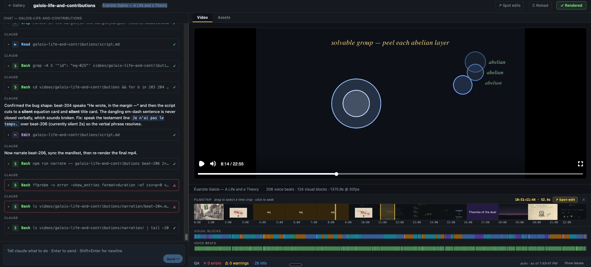
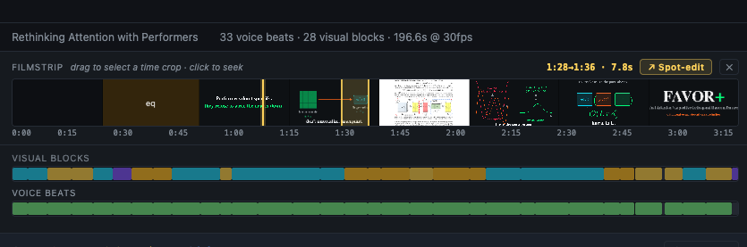
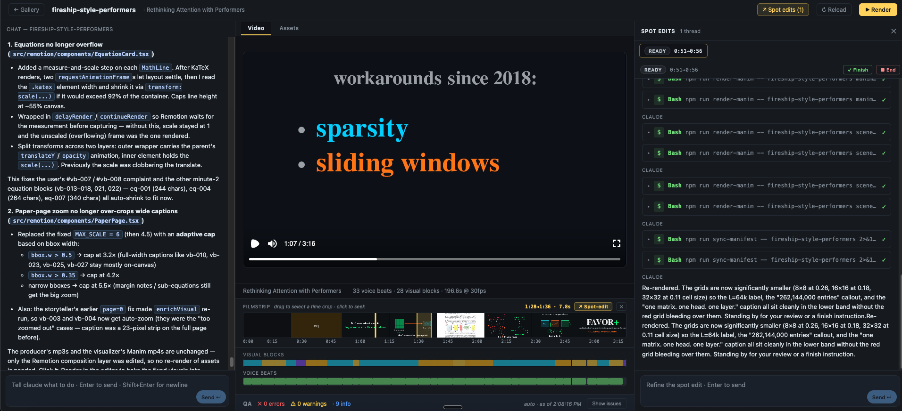
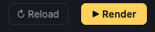

# paper-videos

Turn an academic paper — or any educational topic — into a 3Blue1Brown-style explainer video, with a live editor that shows the video being built beat-by-beat as the agent pipeline runs.



Point at an arXiv id, URL, local PDF, or just say *"explain backpropagation"*. The pipeline drafts a script in the showman cold-open style, narrates it with ElevenLabs, animates the math with Manim, and assembles the result with Remotion. The editor at `localhost:5173` lets you watch it materialize, scrub the partial timeline, spawn pin-point spot-edit threads on time-crops of the video, and click a single button to render the final mp4.

```
arXiv id  →  fetch PDF + extract paper  →  critic plans the brief
                                             ↓
                                          storyteller writes script
                                             ↓
                                  asset-fetcher resolves images / diagrams
                                             ↓
                       producer narrates each beat (live-syncs after every one)
                                             ↓
                       visualizer renders Manim per beat (live-syncs after every one)
                                             ↓
                       you click ▶ Render in the editor → output.mp4
```

The orchestrator is **Claude Code itself** running inside the repo. The repo provides a top-level `CLAUDE.md` doctrine, a `.claude/` skill (`/paper-video`) plus six specialist subagents, deterministic CLI scripts in `src/tools/`, a typed Remotion package in `src/remotion/`, and an interactive editor in `editor/`.

## Status

Initial release — alpha. The pipeline produces real videos end-to-end (see `videos/attention-is-all-you-need/output.mp4`), the editor is stable, but expect rough edges and breaking changes. Feedback on `CONTRIBUTING.md` workflow and any missing edge cases is welcome.

## Setup

### One-shot install

```bash
./install.sh   # idempotent — re-run any time
```

The script:
- checks Node 20+ (you install it yourself if missing)
- installs **uv** (Python runtime manager) if missing
- installs **ffmpeg** via `brew` (macOS) or `apt-get` (Debian/Ubuntu) if missing
- runs `npm install`, `uv sync` (Manim + Marker + PyMuPDF), and `npx remotion browser ensure`
- copies `.env.example` → `.env` so you can fill in `ELEVENLABS_API_KEY`
- installs **TinyTeX** + the LaTeX packages Manim's `MathTex` needs (skip with `./install.sh --quick`)
- updates git submodules if `.gitmodules` is present

After it finishes, do these once:

```bash
claude /login            # OAuth into Claude Code (the orchestrator + chat backend)
$EDITOR .env             # paste your ElevenLabs API key
./run.sh                 # start the editor
```

The `claude` CLI itself isn't auto-installed (it has its own OAuth flow) — get it from <https://docs.claude.com/claude-code>.

### Manual setup (alternative)

If you'd rather drive the install yourself, the steps `install.sh` runs are:

```bash
# 1. system deps
node --version                                   # need 20+
curl -LsSf https://astral.sh/uv/install.sh | sh  # uv (Python)
brew install ffmpeg                              # or: sudo apt-get install ffmpeg
# Claude Code CLI: https://docs.claude.com/claude-code

# 2. project deps
npm install
uv sync                                          # Manim, Marker, PyMuPDF
npx remotion browser ensure                      # Chrome Headless Shell
git submodule update --init --depth 1            # optional

# 3. configure
cp .env.example .env                             # then paste ELEVENLABS_API_KEY

# 4. TinyTeX (required by Manim's MathTex; without it equations fall back to broken Unicode)
curl -sL "https://yihui.org/tinytex/install-bin-unix.sh" | sh
~/Library/TinyTeX/bin/universal-darwin/tlmgr install \
  standalone preview dvisvgm xcolor amsmath amsfonts \
  physics mathtools wasysym jknapltx fontspec babel-english
```

ElevenLabs voices live in `references/usage/elevenlabs/voices.yaml`. The default alias is `pharaoh`; add your own voice ids there if you want to switch. `src/tools/render-manim.ts` auto-prepends `~/Library/TinyTeX/bin/universal-darwin` to `PATH`, so `npm run render-manim` finds TinyTeX without further configuration. Claude Code itself uses your existing `claude /login` OAuth session — no key in `.env`.

## Quickstart — your first video in ~30 minutes

The editor is the recommended way to drive everything. CLI-only is also supported; see [CLI reference](#cli-reference) below.

### 1. Start the editor

```bash
./run.sh
```

This kills any leftover dev processes, runs both the server and the client side-by-side with prefixed colored logs, and exposes:

- **Client** (Vite): http://localhost:5173 — the UI you interact with.
- **Server** (Express + WebSocket): http://localhost:5174 — the chat backend and render manager.

Ctrl+C kills both cleanly.

### 2. Open the gallery

Visit http://localhost:5173. You see a thumbnail-card gallery of every video in `videos/` — each card showing the paper title, slug, duration, beat / block counts, and a **`✓ rendered`** pill on videos whose `output.mp4` exists. Cards with a running pipeline show a blue **`running`** pill instead. Click **+ New video** in the top-right, give it a slug (kebab-case), and you land on the editor view. Hovering a card reveals an **✕** delete button (top-left of the thumbnail) — click it and confirm to wipe the video folder and all its artifacts.


*The gallery — your home. Each card opens an editor; the gold `+ New video` button starts a fresh project.*

### 3. Tell claude what to make

The editor opens in **chat-only "draft" mode** — no canvas yet. Two ways in:

**Paper mode** — paste an arXiv id, URL, or local PDF path:

```
make a video about "Attention Is All You Need" by Vaswani et al
1706.03762
~/Downloads/some-paper.pdf
```

Claude fetches the PDF, runs the paper-extractor, and seeds `videos/<slug>/`.

**Topic mode** — give a free-form prompt with no paper attached:

```
make a video explaining backpropagation
Galois theory in 10 minutes
```

Claude scaffolds `videos/<slug>/topic.md` and skips paper extraction. The critic does its own research (textbooks, web, canonical sources) and may opportunistically pull a canonical paper if one would materially strengthen the explanation. Topic mode is the path for educational explainers that aren't tied to a single paper.

The player materializes the moment the manifest exists in either mode.

Claude will ask one question early on: **"Render bottom captions over the video? (default no)"**. Pick from the in-panel question card; your answer flows back as the next chat turn. Captions are off by default.

### 4. Watch the video build live

When the pipeline runs, the producer + visualizer call `npm run sync-manifest` after **every single beat** — so the player shows new beats appearing one-by-one with the **teaser landing first** (see [Doctrine § 20-24](#doctrine-the-twenty-four-rules) below). You can scrub the partial timeline at any moment.

Each beat that has audio but is still waiting on its Manim mp4 shows a "Rendering: <scene>…" placeholder card while the audio still plays — voice never blocks waiting on visuals.

### 5. Spot-edit a time crop

Spot-edits are **time-crop scoped**, not beat-scoped: drag a horizontal selection on the filmstrip and a gold band appears with the time range (e.g. `1:28→1:36 · 7.8s`) plus a **↗ Spot-edit** pill in the toolbar.


*Drag horizontally on the filmstrip to select a time range. The gold band and the **↗ Spot-edit** button appear in the toolbar — click to fork an agent scoped to that crop.*

Click **↗ Spot-edit** → the right-side **Spot edits** panel opens with an in-panel composer pre-scoped to that crop. Type "shorten this by 30%" or "rewrite this without jargon" → press Enter → a forked claude session runs in parallel without disrupting the parent chat. The harness pre-resolves which voice beats and visual blocks overlap the crop and passes them to the agent as a finding aid (not a hard constraint). When the thread finishes, a `Spot edit on 1:28→1:36 — completed: …` notice card lands in the parent chat with the agent's summary, and the parent agent receives the same notice as part of its next-turn directive (so the main thread stays in sync).

You can spawn **multiple concurrent spot-edits** — each one becomes its own tab at the top of the panel. Click between tabs to follow each thread independently.


*Spot-edit threads dock on the right. Each is a forked `claude --resume` session — they run in parallel with the parent chat, and their completion summaries land back in the parent thread automatically.*

### 6. Render the final mp4

When you're satisfied, click the gold **▶ Render** button in the editor header.


*Top-right of the editor: **↻ Reload** refetches manifest + assets; the gold **▶ Render** kicks off `npm run render-remotion`.*

The button fills with a green progress bar (`Rendering 42%`) and tooltips the latest log line. On success it flashes green, the player auto-refreshes with the new mp4, and the file lands at `videos/<slug>/output.mp4`. On failure the tooltip carries the tail of the log so you can see what broke.

Render is button-driven only — agents do not run `render-remotion` themselves (see [§ Render is a button, not an agent action](#render-is-a-button-not-an-agent-action)).

## The editor in detail


*The editor's three columns: parent **chat** on the left, **video player + filmstrip lanes** in the middle, **spot-edit threads** on the right. Everything is live — the player remounts the moment any beat finishes.*

Layout:

```
┌────────── header ──────────────────────────────────────────────────────────────┐
│ ← Gallery   <slug>    ↗ Spot edits    ↻ Reload     ▶ Render                    │
├──────────────────┬─────────────────────────────────────┬───────────────────────┤
│                  │ Video / Assets tab                  │ Spot edits panel       │
│                  ├─────────────────────────────────────┤                       │
│   Chat panel     │  Remotion player                    │  Threads list +       │
│   (parent claude │   (lazy-rendered, scrubable)        │  composer / detail    │
│    session per   ├─────────────────────────────────────┤                       │
│    slug, with    │  Filmstrip lane (thumbnails +       │                       │
│    history       │   draggable playhead, iMovie-style) │                       │
│    persisted to  ├─────────────────────────────────────┤                       │
│    .cache/)      │  Visual blocks lane                 │                       │
│                  │  Voice beats lane                   │                       │
│                  │  QA banner (if issues exist)        │                       │
└──────────────────┴─────────────────────────────────────┴───────────────────────┘
```

- **Live preview**: Remotion's `<Player>` renders frames on demand into a canvas; nothing is pre-rendered ahead of time. The Manim mp4s are pre-rendered (Python can't run in-browser) and the `<Video>` element decodes them natively.
- **Filmstrip**: thumbnail per representative-still per visual block (paper-page PNG, Manim last-frame, image/diagram asset). Click or drag to scrub. The playhead syncs via `requestAnimationFrame` so it doesn't trigger React re-renders during playback.
- **Spot-edit threads**: each thread is a separate `claude --resume <thread-session-id>` subprocess on the server, scoped to one beat or block. The thread survives WS disconnects (refresh the page, reconnect, history replays). Completed threads inject a notice into the parent chat that's also persisted across server restarts.
- **Assets tab**: file-tree of the slug folder; preview pane shows mp3s, mp4s, PNGs, PDFs, JSON, code with sensible defaults per mime.
- **Markdown rendering**: chat replies render full GFM (tables, code blocks, lists, blockquotes) with mention chips for tokens like `#beat-005`, `#vb-003`, `[selection 00:14→00:23]`.
- **Persistent history**: parent-chat events go to `videos/<slug>/.cache/chat-history.jsonl` (gitignored). Restart the server, the chat is intact and `claude --resume` picks up the actual conversation context too.

## The pipeline (six specialist subagents)

| Agent | Reads | Writes |
|---|---|---|
| **paper-extractor** | `paper.pdf` | `paper.md`, `equations.json`, `pages/page-NNN.png`, `paper-md-assets/` |
| **critic** | `paper.md`, `equations.json`, web | `brief.json` (creative brief: thesis, narrative arc starting with `act-0: Teaser`, what to cut, visual suggestions) |
| **storyteller** | `brief.json`, `paper.md`, `equations.json` | `script.md` (beat-by-beat storyboard opening with a 5-8 beat teaser) |
| **asset-fetcher** | `script.md`, `brief.json`, paper figures, web | `images/img-NNN.png`, `diagrams/diag-NNN.svg`, `assets-index.json` |
| **producer** | `script.md`, `voices.yaml`, `.env` | `narration/beat-NNN.{mp3,timestamps.json}` + per-beat `npm run sync-manifest` |
| **visualizer** | All of the above | `manim/beat-NNN.{py,mp4}` + per-beat `npm run sync-manifest` |

Each agent has its own context window. The `videos/<slug>/` folder is the persistent contract between them.

The orchestrator (the agent running in the editor's chat) drives this top-to-bottom, delegating to subagents via the Task tool. Each delegate has its own short, focused prompt in `.claude/agents/`.

## Doctrine — the twenty-four rules

`CLAUDE.md` codifies the operating rules. Highlights:

1. **One video = one folder.** All artifacts for video X live in `videos/<X>/`.
2. **Equations are sacred.** LaTeX comes only from `equations.json`. Never invented.
3. **Audio drives the timeline.** Every visual `<Sequence>` range comes from word-level ElevenLabs timestamps.
4. **Beats are sized for breathing.** 8-40 words / 2-10 seconds each. Each mp3 is auto-padded with leading + trailing silence.
5. **Tools are JSON in / JSON out.**
6. **Delegate to subagents** via Task — never inline their work.
7. **Confirm voice before TTS.**
8. **No secrets in code or git.** ElevenLabs key in `.env` (gitignored).
9. **Read `references/usage/` first** for any area; fall back to `references/raw-packages/` only when needed.
10. **Quality gate after the first 3 narrated beats.** Producer stops, asks the user to listen.
11. **Audio tags for personality.** Default model is `eleven_v3` — bracketed tags like `[curious]`, `[serious]`, `[emphasized]` give the video a 3Blue1Brown-style cadence. ≥60% of beats have NO tag.
12. **Voice and visual run on independent timelines.** Manifest v2: `voice[]` (1:1 with TTS clips) and `visualBlocks[]` (visual spans). Manim mp4s play once and **hold their final frame** for the rest of the block — no looping.
13. **LaTeX required for Manim text.** Use `MathTex(...)` for math notation. Never substitute Unicode.
14. **Manim scenes end on a held tableau, never `FadeOut`.** Held black is indistinguishable from a broken render.
15. **Animation-first pacing.** Voice fits the visual, not the other way around.
16. **Soft transitions between visual blocks** (single canvas doctrine). `<BlockFade>` fades each block in/out through the dark-navy background.
17. **Visual continuity over re-emission.** Adjacent same-content beats use `[VISUAL: continue]` so the migrator can coalesce them into one block.
18. **QA before sign-off.** `npm run qa -- <slug>` flags audio overlaps, missing files, equation typos, bbox out-of-bounds, etc.
19. **Highlight by quote, not coordinates.** `quote="exact text on the page"` — the harness extracts the bbox from the PDF text layer. Add `zoom=true` for small-text excerpts to crop+scale into the canvas.
20. **Every video opens with a teaser.** Acts: `act-0` (Teaser, 15-25 seconds, 5-8 beats) → `act-1` (Why care?) → `act-2` (Setup) → ... The title card is the LAST beat of the teaser, not the first. Generic openers (`"This paper introduces..."`, `"In this video we'll explore..."`) are banned.
21. **Live preview: sync the manifest after every per-beat operation.** Producer runs `npm run sync-manifest` after every narrate; visualizer runs it after every render-manim. The editor's chokidar watcher fires `preview:reload` on every manifest write → the user sees the video grow live.
22. **Equations fit the frame; small highlights auto-zoom.** Every Manim equation wraps in `fit_to_frame(...)` (idempotent, scales down only if the mobject overflows). The harness auto-applies `zoom: true` to paperPage highlights whose resolved bbox covers `h < 0.08` or area < 4% of the page (single-line captions, sub-equations inside figures). The zoom mode uses aspect-FILL with a 6× cap so thin captions reach readable size; the corner page-mini preserves spatial context.
23. **Render is button-driven.** The orchestrator's job ends after the visualizer places every Manim mp4. The user clicks **▶ Render** in the editor header to produce `output.mp4`. Agents do not run `npm run render-remotion` themselves.

Full text in [`CLAUDE.md`](CLAUDE.md).

## Render is a button, not an agent action

Earlier versions had agents run `npm run render-remotion` at the end of the pipeline. That's now **strictly forbidden** — render is a UI action only, triggered by the **▶ Render** button in the editor header. Reasons:

- Renders are expensive (CPU + minutes); the user should choose when to spend that.
- Asset-pipeline runs and final-render runs are different kinds of work.
- The button shows live progress (percent + log tail) and a clean ✓/✕ flash on completion — agent-driven renders had to be inferred from chat output.

The orchestrator's job ends after the visualizer has placed every Manim mp4. It then tells the user "Assets ready — click ▶ Render".

## CLI reference

You can drive the whole pipeline from the CLI without the editor — useful for headless runs, CI, scripts.

```bash
npm run fetch-paper -- <id|url|path> <slug>      # paper mode: download PDF + seed config
npm run new-topic -- "<topic prompt>" <slug>     # topic mode: scaffold topic.md + manifest (no paper)
npm run extract-paper -- <slug>                  # Marker → paper.md + equations.json
npm run render-pages -- <slug>                   # pdfjs → pages/page-NNN.png
npm run arxiv-search -- "<query>"                # arXiv search, JSON to stdout
npm run narrate -- <slug> <beat_id>              # ElevenLabs TTS for one beat
npm run resolve-bbox -- <slug> <pageNum> <quote> # PDF text-layer → normalized bbox JSON
npm run render-manim -- <slug> <scene_file> <Class>
npm run sync-manifest -- <slug>                  # live-preview: incremental rebuild
npm run migrate-manifest-v2 -- <slug>            # one-shot v1 → v2 migration on disk
npm run qa -- <slug>                             # deterministic QA report
npm run render-remotion -- <slug>                # final mp4 (also what the ▶ Render button calls)
```

You can also invoke the orchestrator directly:

```bash
# (Optional) put the wrapper on PATH
ln -s "$PWD/bin/claude-paper-videos" ~/.local/bin/claude-paper-videos

# Then from inside the repo
claude-paper-videos new 1706.03762               # scaffold + run paper-extractor
claude-paper-videos render <slug>                # full asset pipeline (no final render)
claude-paper-videos script <slug>                # re-run critic + storyteller only
claude-paper-videos list                         # gallery on the terminal
```

Or just run `claude` inside the repo and call `/paper-video new <source>` etc. yourself.

## Per-video output structure

```
videos/<slug>/
├── config.yaml                          # paper source, voice, captions, target length
├── manifest.json                        # source-of-truth (v2 voice[] + visualBlocks[])
├── paper.pdf                            # tracked in git? no — generated artifacts are gitignored
├── paper.md                             # Marker output
├── equations.json                       # extracted LaTeX, page index, bbox
├── pages/page-NNN.png                   # rendered paper pages
├── images/img-NNN.png                   # asset-fetcher output
├── diagrams/diag-NNN.svg
├── assets-index.json                    # asset id → file mapping
├── highlights.json                      # selected paper quotes for pull-outs
├── script.md                            # the beat-by-beat storyboard
├── narration/
│   ├── beat-NNN.mp3                     # ElevenLabs TTS audio (auto-padded)
│   └── beat-NNN.timestamps.json         # word-level timing data
├── manim/
│   ├── beat-NNN.py                      # one Manim scene per [MANIM] cue
│   └── beat-NNN.mp4                     # rendered animation
├── manim-durations.json                 # ffprobe results for each mp4 (for the renderer)
├── manim-last-frames/<scene>.png        # held-final-frame snapshots
├── public/                              # auto-mirror used by Remotion bundler + editor /static
├── qa-report.json                       # deterministic QA findings (per `npm run qa`)
├── .cache/                              # gitignored — chat history, render thumbs, etc.
│   ├── chat-history.jsonl               # parent-chat persistence
│   └── thumb.png                        # gallery thumbnail
└── output.mp4                           # final video (after ▶ Render)
```

## Project layout

```
src/tools/                       # Deterministic CLI scripts (TS) the agent invokes
src/lib/                         # Shared utilities — manifest schema, paths, timing,
                                 # bbox resolver, QA, prepare-preview
src/remotion/                    # React/Remotion composition + reusable components
.claude/skills/paper-video/      # Orchestrator skill (/paper-video subcommands)
.claude/agents/*.md              # Six specialist subagents (frontmatter + prompt)
editor/server/                   # Express + WS hub: chat store, threads, render
                                 # manager, file watcher, project routes
editor/client/                   # Vite + React: gallery, editor page, player,
                                 # filmstrip, chat panel, threads panel, assets tab
references/usage/<area>/         # Hand-curated cheat sheets — read first
references/raw-packages/         # Optional submodules: Manim, Remotion, 3b1b-videos
videos/<slug>/                   # One folder per video — see above
CLAUDE.md                        # Doctrine — auto-loaded by the orchestrator
run.sh                           # Start the editor (server + client) with both logs
```

## Configuration

### Per-video — `videos/<slug>/config.yaml`

```yaml
slug: attention-is-all-you-need
paperSource: { kind: arxiv, value: "1706.03762", arxivId: "1706.03762" }
paperTitle: "Attention Is All You Need"
voice: pharaoh                      # alias from references/usage/elevenlabs/voices.yaml
captions: false                     # render bottom CaptionBar on the final video
targetLengthMinutes: 12
focusAreas: []                      # narrows the brief if non-empty
resolution: { width: 1920, height: 1080 }
fps: 30
```

The captions flag is asked once on `/paper-video new` (default `false`). To flip it later, edit `config.yaml` AND set `captions: true` in `manifest.json`, then re-render.

### Voices — `references/usage/elevenlabs/voices.yaml`

Maps short aliases (`pharaoh`, `narrator`, etc.) to ElevenLabs voice ids + per-voice settings (`model_id`, `stability`, `similarity_boost`, `style`, `use_speaker_boost`, `output_format`). Add your own voice ids from https://elevenlabs.io/app/voice-library.

### Audio tags

The orchestrator embeds bracketed tags like `[curious]`, `[serious]`, `[emphasized]`, `[wistful]` in narration text to give the video a 3Blue1Brown-style cadence. ≥60% of beats have NO tag — they appear only when the narrator's tone is doing real semantic work. Theatrical tags (`[laughs]`, `[shouts]`) are forbidden on academic content. The full curated list is in `references/usage/elevenlabs/README.md` § 3a.

### Captions

Off by default. When on, the renderer draws a bottom caption bar with word-by-word highlighting synced to the ElevenLabs timestamps. ElevenLabs `[tag]` tokens are stripped from the visible captions even though they steer prosody server-side.

## Troubleshooting

**`claude` CLI not on PATH**: install Claude Code (https://docs.claude.com/claude-code), then `claude /login`. The editor server logs a warning on startup if it can't find it; chat will report errors until it's available.

**Remotion player shows a black frame**: this used to happen when the bundle's manifest fetch silently 404'd. The `PaperExplainerCore` component now takes pre-fetched data via `inputProps` and never depends on `staticFile()` resolution, so the failure mode is gone. If you still see black, check the browser devtools network tab for any 404 on `/static/<slug>/*`.

**Yellow `[20 9C]` boxes in Manim output**: TinyTeX isn't installed (or `tlmgr` is missing the packages listed in [§ 4](#4-latex-required-by-manims-mathtex)). Run the install steps and re-render.

**Highlights land on the wrong text**: you're using manual `highlight="x,y,w,h"` coordinates. Switch to `quote="exact phrase from the page"` — the harness extracts the bbox from the PDF text layer (`src/lib/resolve-bbox.ts`). See doctrine rule 19.

**`ELEVENLABS_API_KEY is not set`**: edit `.env` (`cp .env.example .env` if you haven't yet).

**Editor port already in use**: `run.sh` kills leftover dev processes on startup. If something else holds the port, find it with `lsof -i :5173` / `lsof -i :5174` and kill it.

**Render button does nothing or fails immediately**: prerequisites are missing. Run `npm run qa -- <slug>` to see what's not ready (mp3s, manim mp4s, etc.). Render only works once all assets are in place.

**Spot-edit thread spawns but never replies**: the forked subprocess inherits your `claude` OAuth session. If you logged out, re-`claude /login` and the next thread will work.

**Captions show ElevenLabs `[tags]` like `[curious]`**: this used to leak when v3 returned the tag chars in alignment data. `src/tools/narrate.ts` now strips them from the timestamps before save. Re-narrate the affected beats.

## Design notes

- **Audio drives time.** Every visual `<Sequence>` range comes from ElevenLabs word-level timestamps. Beats that haven't been narrated yet aren't in the timeline at all (live-preview truncates cleanly).
- **Manifest v2 — independent voice + visual tracks.** `voice[]` is 1:1 with TTS clips; `visualBlocks[]` is multi-step visual spans coalesced from adjacent same-content beats. One block can span many voice beats. Manim mp4s play once and hold their final frame for the rest of the block.
- **Soft transitions through the bg.** `<BlockFade>` fades each block in/out through the dark-navy background — the whole video reads as one continuous canvas being written, blanked, and rewritten.
- **Quote-anchored highlights.** Storytellers can't see pixel coordinates. `quote="..."` → PDF text-layer extraction → tight bbox, automatically.
- **Stateless tools.** Every script in `src/tools/` is idempotent, takes args, writes JSON the agent can read back. The agent never holds state across calls.
- **Live sync as the default loop.** Per-beat narrate + manifest sync makes the user the loop's regulator: if the teaser sounds wrong, you stop the run after 60 seconds, edit, and resume.

## Contributing

PRs welcome. Read [CONTRIBUTING.md](CONTRIBUTING.md) for setup + ground rules and [CLAUDE.md](CLAUDE.md) for the operating doctrine. By participating you agree to our [Code of Conduct](CODE_OF_CONDUCT.md). Security issues: see [SECURITY.md](SECURITY.md).

If you want to add a new visual kind, a new voice, a new agent, or a new editor panel, open an issue first — the architecture has strong opinions and a five-minute conversation saves a few hours of redo.

## License

[MIT](LICENSE) © 2026 Lucas Tonon
